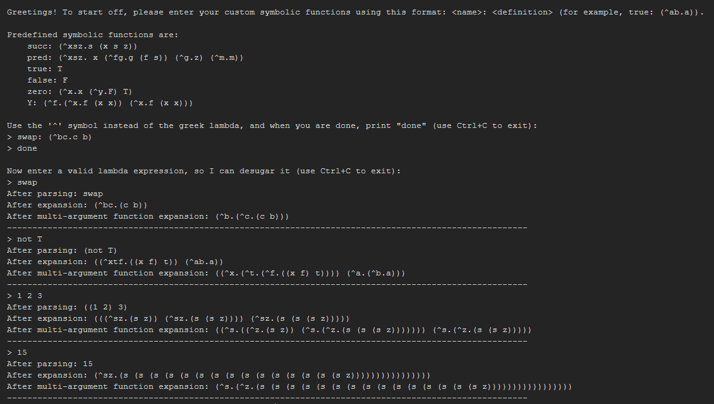

# BI-PPA semestral work by Nikita Mortuzaiev

This is a simple **Lambda Calculus** parser and "desugarer" program written in **Python**.
The desugaring is a process of removing symbolic functions from a lambda calculus
expression, expanding Church numbers, bool literals, arithmetical and logical
operators and multi-argument functions to fit the pure Lambda Calculus definition.

Lambda Calculus Wiki: https://en.wikipedia.org/wiki/Lambda_calculus

### Syntax of input expressions

To write a lambda function, use parentheses and the `^` symbol instead of Greek lambda.
For example: `(^x.x)` is an equivalent for `λx.x`.

To write an operator expression, type an operator and then its operands (all separated
by spaces). For example: `+ x y`, `and T F`, `not a` and so on.

To use an application, type two or more application parts separated by a space: `x y`,
`(^x.x) 1`, `x y z t` (which is equivalent for `(((x y) z) t)`).

To use a symbolic function, check the `symbolic_functions` dictionary in `node.nodes`
module. You can easily extend this dictionary with custom definitions. To do this,
type a symbolic function name as an item key and its definition as its value. You
can check existing symbolic functions expansions in the provided tests modules.

### Examples

### Installation and running

To run, clone the repository, activate the devcontainer and type this:

`python src/main.py`

or just this:

`lamb_da`

The application is written in the pure python with the usage of `re` module, so no
additional libraries need to be installed.
